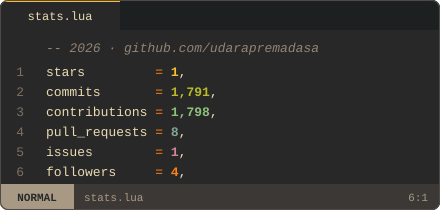
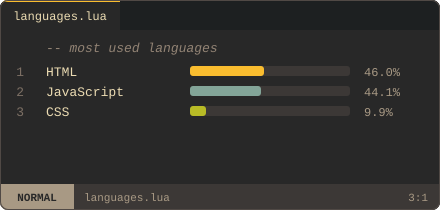

  <picture>
    <source media="(prefers-color-scheme: dark)" srcset="assets/nvim-gruvbox-dark.svg">
    <source media="(prefers-color-scheme: light)" srcset="assets/nvim-gruvbox-light.svg">
    
  </picture>

 

  <picture>
    <source media="(prefers-color-scheme: dark)" srcset="assets/stats-dark.svg">
    <source media="(prefers-color-scheme: light)" srcset="assets/stats-light.svg">
    
  </picture>
  <picture>
    <source media="(prefers-color-scheme: dark)" srcset="assets/langs-dark.svg">
    <source media="(prefers-color-scheme: light)" srcset="assets/langs-light.svg">
    
  </picture>

  <picture>
    <source media="(prefers-color-scheme: dark)" srcset="https://streak-stats.demolab.com?user=udarapremadasa&hide_border=true&background=282828&ring=fabd2f&fire=fe8019&currStreakNum=ebdbb2&sideNums=ebdbb2&currStreakLabel=fabd2f&sideLabels=a89984&dates=928374">
    <source media="(prefers-color-scheme: light)" srcset="https://streak-stats.demolab.com?user=udarapremadasa&hide_border=true&background=fbf1c7&ring=b57614&fire=af3a03&currStreakNum=3c3836&sideNums=3c3836&currStreakLabel=b57614&sideLabels=7c6f64&dates=928374">
    
  </picture>

 

  <!-- statusline-style tech badges -->
  <picture>
    <source media="(prefers-color-scheme: dark)" srcset="https://img.shields.io/badge/TypeScript-282828?style=for-the-badge&logo=typescript&logoColor=83a598">
    <source media="(prefers-color-scheme: light)" srcset="https://img.shields.io/badge/TypeScript-fbf1c7?style=for-the-badge&logo=typescript&logoColor=076678">
    
  </picture>
  <picture>
    <source media="(prefers-color-scheme: dark)" srcset="https://img.shields.io/badge/React-282828?style=for-the-badge&logo=react&logoColor=8ec07c">
    <source media="(prefers-color-scheme: light)" srcset="https://img.shields.io/badge/React-fbf1c7?style=for-the-badge&logo=react&logoColor=427b58">
    
  </picture>
  <picture>
    <source media="(prefers-color-scheme: dark)" srcset="https://img.shields.io/badge/Node.js-282828?style=for-the-badge&logo=nodedotjs&logoColor=b8bb26">
    <source media="(prefers-color-scheme: light)" srcset="https://img.shields.io/badge/Node.js-fbf1c7?style=for-the-badge&logo=nodedotjs&logoColor=79740e">
    
  </picture>
  <picture>
    <source media="(prefers-color-scheme: dark)" srcset="https://img.shields.io/badge/Go-282828?style=for-the-badge&logo=go&logoColor=83a598">
    <source media="(prefers-color-scheme: light)" srcset="https://img.shields.io/badge/Go-fbf1c7?style=for-the-badge&logo=go&logoColor=076678">
    
  </picture>
  <picture>
    <source media="(prefers-color-scheme: dark)" srcset="https://img.shields.io/badge/C%2B%2B-282828?style=for-the-badge&logo=cplusplus&logoColor=fb4934">
    <source media="(prefers-color-scheme: light)" srcset="https://img.shields.io/badge/C%2B%2B-fbf1c7?style=for-the-badge&logo=cplusplus&logoColor=9d0006">
    
  </picture>
   
  <picture>
    <source media="(prefers-color-scheme: dark)" srcset="https://img.shields.io/badge/Google%20Cloud-282828?style=for-the-badge&logo=googlecloud&logoColor=fabd2f">
    <source media="(prefers-color-scheme: light)" srcset="https://img.shields.io/badge/Google%20Cloud-fbf1c7?style=for-the-badge&logo=googlecloud&logoColor=b57614">
    
  </picture>
  <picture>
    <source media="(prefers-color-scheme: dark)" srcset="https://img.shields.io/badge/Docker-282828?style=for-the-badge&logo=docker&logoColor=83a598">
    <source media="(prefers-color-scheme: light)" srcset="https://img.shields.io/badge/Docker-fbf1c7?style=for-the-badge&logo=docker&logoColor=076678">
    
  </picture>
  <picture>
    <source media="(prefers-color-scheme: dark)" srcset="https://img.shields.io/badge/Kubernetes-282828?style=for-the-badge&logo=kubernetes&logoColor=83a598">
    <source media="(prefers-color-scheme: light)" srcset="https://img.shields.io/badge/Kubernetes-fbf1c7?style=for-the-badge&logo=kubernetes&logoColor=076678">
    
  </picture>
  <picture>
    <source media="(prefers-color-scheme: dark)" srcset="https://img.shields.io/badge/Linux-282828?style=for-the-badge&logo=linux&logoColor=ebdbb2">
    <source media="(prefers-color-scheme: light)" srcset="https://img.shields.io/badge/Linux-fbf1c7?style=for-the-badge&logo=linux&logoColor=3c3836">
    
  </picture>
  <picture>
    <source media="(prefers-color-scheme: dark)" srcset="https://img.shields.io/badge/Neovim-282828?style=for-the-badge&logo=neovim&logoColor=b8bb26">
    <source media="(prefers-color-scheme: light)" srcset="https://img.shields.io/badge/Neovim-fbf1c7?style=for-the-badge&logo=neovim&logoColor=79740e">
    
  </picture>

 

  <a href="https://codimite.ai">
    <picture>
      <source media="(prefers-color-scheme: dark)" srcset="https://img.shields.io/badge/codimite.ai-1d2021?style=for-the-badge&logo=googlechrome&logoColor=fe8019">
      <source media="(prefers-color-scheme: light)" srcset="https://img.shields.io/badge/codimite.ai-f9f5d7?style=for-the-badge&logo=googlechrome&logoColor=af3a03">
      
    </picture>
  </a>
  <a href="https://www.linkedin.com/in/udarapremadasa/">
    <picture>
      <source media="(prefers-color-scheme: dark)" srcset="https://img.shields.io/badge/LinkedIn-1d2021?style=for-the-badge&logo=linkedin&logoColor=83a598">
      <source media="(prefers-color-scheme: light)" srcset="https://img.shields.io/badge/LinkedIn-f9f5d7?style=for-the-badge&logo=linkedin&logoColor=076678">
      
    </picture>
  </a>
  <a href="https://twitter.com/udara_premadasa">
    <picture>
      <source media="(prefers-color-scheme: dark)" srcset="https://img.shields.io/badge/@udara__premadasa-1d2021?style=for-the-badge&logo=x&logoColor=ebdbb2">
      <source media="(prefers-color-scheme: light)" srcset="https://img.shields.io/badge/@udara__premadasa-f9f5d7?style=for-the-badge&logo=x&logoColor=3c3836">
      
    </picture>
  </a>

 

  <code>:wq</code>

